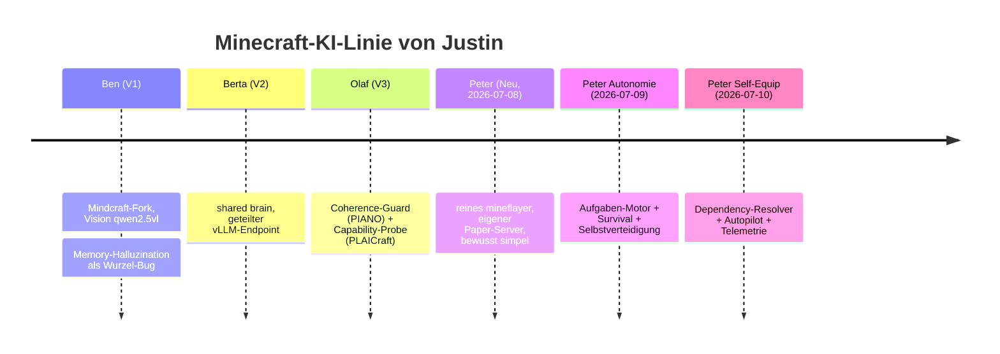
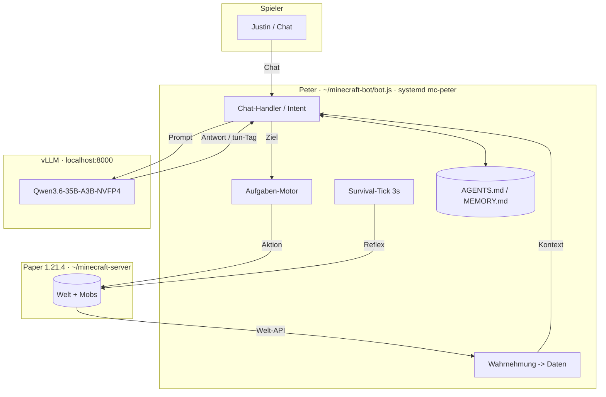
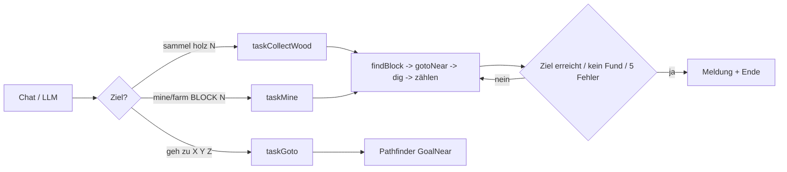
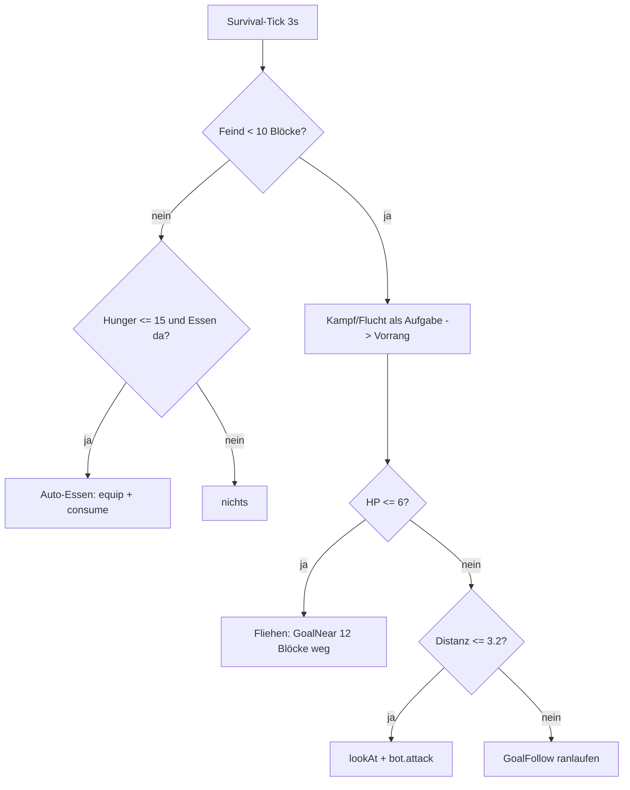
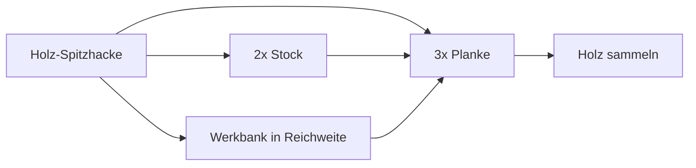
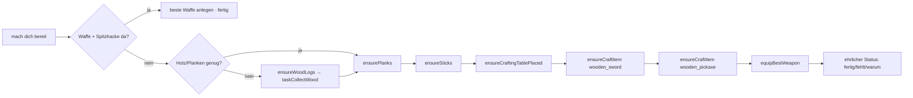

# 🤖 Peter — Autonomer Minecraft-KI-Agent

> [!abstract] TL;DR
> **Peter** ist ein lokaler Minecraft-KI-Mitspieler auf **gx10**, gebaut mit reinem
> [mineflayer](https://github.com/PrismarineJS/mineflayer) + lokalem **Qwen3.6-35B** (vLLM).
> Am **2026-07-09** vom reaktiven Chat-Bot zum **autonomen Agenten** ausgebaut:
> deterministischer **Aufgaben-Motor** (verfolgt Ziele über viele Ticks bis zum Abschluss),
> **Survival** (Auto-Essen, Kampf/Flucht), Ziel-Setzung per Keyword *und* LLM.
> **Bewiesen:** Peter hat sich selbst aus einem Zombie-Death-Loop am Spawn befreit
> (vorher Tod alle ~7 s, danach 0 Tode durch Flucht).
> **Update 2026-07-10:** Roadmap #1 erledigt — Peter **rüstet sich autonom selbst aus**
> (Holz → Planken/Stöcke/Werkbank → Holzschwert + Holzspitzhacke, *live im Spiel bewiesen*),
> dazu ein **LLM-freier Autopilot** (spielt selbstständig die Tech-Leiter hoch) und eine
> **Telemetrie** (`telemetry.jsonl`) fürs Daten-Sammeln. Details → Abschnitt „Update 2026-07-10".
>
> Kern-Notiz: [[MinecraftAI]] · Gerät: [[Rechner GB10]] · LLM: [[Qwen3.6 Reasoning-Toggle]]

---

## 1. Was Peter *ist* (und was nicht)

Peter ist **kein** LLM, das die Welt „sieht" und frei handelt. Er ist ein **deterministischer
Agent mit dünner LLM-Absichtsschicht**:

- **Deterministischer Kern** — Wahrnehmung als Daten, ein Aufgaben-Motor, Survival-Reflexe.
  Das ist der verlässliche Teil.
- **LLM als Übersetzer** — Qwen3.6 wandelt Chat („komm", „sammel Holz") in Ziele und plaudert.
  Das ist der flexible, aber flakey Teil.

> [!tip] Leitprinzip
> **Zuverlässigkeit kommt aus dem Code, Flexibilität aus dem LLM.** Ein 35B-Modell lokal,
> non-thinking, wird nie ein zuverlässiger *Executor* — aber ein guter *Intent-Übersetzer*.
> Das ist die zentrale Architektur-Entscheidung (analog Voyager & Co.).

---

## 2. Historie



Justin hat die alte Linie (Ben/Berta/Olaf, [[botv2-minecraft]]) **gelöscht** und am 2026-07-08
frisch mit reinem mineflayer neu aufgebaut — Schritt für Schritt, nicht das schwere
Mindcraft-Framework. Am 2026-07-09 kam die Autonomie-Schicht dazu.

---

## 3. Architektur



### 3.1 Server
- **Paper 1.21.4** (build 232), Java 21, `-Xmx4G`, in `~/minecraft-server/`. Start: `./start.sh`.
- Join über **Tailscale**: `100.75.47.118:25565`. `online-mode=false` + `enforce-secure-profile=false`
  (damit der Offline-Bot joint). Justin ist **OP**.
- Feste Map: `level-seed=-8805009358920899152`.
- > [!warning] ARM64-Falle: **spark-Profiler MUSS aus**
>   `config/paper-global.yml → spark.enabled: false`. Sonst crasht die JVM auf gx10 (aarch64)
>   hart mit SIGSEGV über `libasyncProfiler`/`AsyncGetCallTrace` nach ~2–3 min.
- ⚠ Server läuft **noch nicht** als systemd-Dienst (loser Hintergrund-Task) → **nicht reboot-fest**.

### 3.2 Bot
- `~/minecraft-bot/bot.js`, Node 24, natives `fetch`, **mineflayer 4.37.1** + `mineflayer-pathfinder`, `vec3`.
- **systemd-User-Dienst** `mc-peter.service`: `Restart=always`, `RestartSec=5`,
  `StartLimitBurst=10/60s`, `linger` an → reboot-fest (der Bot, nicht der Server).
  - Verwalten: `systemctl --user {status,restart,stop} mc-peter`
  - Logs: `journalctl --user -u mc-peter -f`
- > [!danger] Nur EINE Instanz
>   Zwei Peters kicken sich gegenseitig („logged in from another location"). **Nie** `node bot.js`
>   manuell starten, solange der Dienst läuft — immer über `systemctl --user restart mc-peter`.

### 3.3 LLM
- vLLM auf `localhost:8000`, Modell `nvidia/Qwen3.6-35B-A3B-NVFP4`.
- > [!important] Qwen-Template-Eigenheiten (siehe [[Qwen3.6 Reasoning-Toggle]])
>   - `chat_template_kwargs: { enable_thinking: false }` — sonst leerer `content` + Timeout.
>   - **Genau EINE** `system`-Message. Ergebnisse/Kontext gehen als `user`-Message rein, nie als 2. system.
- Aufruf-Parameter: `max_tokens: 160`, `temperature: 0.7`, **30 s** AbortController-Timeout.

---

## 4. Wahrnehmung (Welt als Daten, keine Vision-KI)

Peter „sieht" über die mineflayer-Welt-API und packt alles in einen `[Wahrnehmung]`-Block:

| Feld | Quelle / Logik |
|---|---|
| Position, HP, Hunger | `bot.entity.position`, `bot.health`, `bot.food` |
| Wesen (max 6) | `bot.entities`, ≤ 32 Blöcke, sortiert nach Distanz, mit Richtung |
| Nahfeld-Blöcke | ±4 (xz) / ±3 (y) um Peter, „langweiliges" Terrain gefiltert, doppelhohe Blöcke (Tür/Bett) entdoppelt |
| Ressourcen | `bot.findBlocks` für Erze/Holz/Wasser, ≤ 24 Blöcke |
| Biom, Zeit, Wetter | `feet.biome`, `bot.time.timeOfDay`, `isRaining`/`thunderState` |
| Blick auf | `bot.blockAtCursor(20)` |
| **Aufgabe** | aktueller `taskLabel` (neu 2026-07-09) |
| Inventar | `bot.inventory.items()` |

> [!note] Richtungs-Logik `relDir()` — **Bug gefixt 2026-07-09**
> War `Math.atan2(-dx, dz)` → für **alle** Himmelsrichtungen wurde die *Gegenrichtung* gemeldet
> (vorne↔hinten **und** links↔rechts vertauscht). Ursache: falsches Vorzeichen; mineflayer nutzt
> `yaw = atan2(-dx, -dz)` (wie `bot.lookAt`).
> **Fix:** sauber über den Blickvektor statt Vorzeichen-Raten:
> ```js
> const fx = -Math.sin(yaw), fz = -Math.cos(yaw);   // Vorwärts
> const rx = -fz, rz = fx;                           // Rechts
> const fwd   = dx*fx + dz*fz;                        // >0 = vorne
> const right = dx*rx + dz*rz;                        // >0 = rechts
> const ang = Math.atan2(right, fwd);                // 0=vorne, ±π=hinten
> ```
> Schwellen: `≤ π/4` vorne, `≥ 3π/4` hinten, sonst rechts/links; `dy>3` oben, `dy<-3` unten.
> **Muss von Justin im Spiel gegengeprüft werden** (er testet immer live, [[justin-testet-live-selbst]]).

---

## 5. Der Aufgaben-Motor (das Herz der Autonomie)

Ein **Ziel** läuft im Hintergrund über viele Ticks bis zum Abschluss und ist jederzeit sauber
abbrechbar — via **Generation-Token**, damit kein Zombie-Task weiterläuft:

```js
let taskGen = 0, taskLabel = null;
function stopTask() { taskGen++; taskLabel = null; bot.pathfinder.setGoal(null); }
function startTask(label, fn) {
  taskGen++; const myGen = taskGen; taskLabel = label;
  const cancelled = () => myGen !== taskGen;      // laufende Task prüft das zwischen Schritten
  Promise.resolve().then(() => fn(cancelled))
    .catch(e => console.log(`Task "${label}" Fehler:`, e?.message))
    .finally(() => { if (myGen === taskGen) taskLabel = null; });
}
```

**Prinzip:** Jede Task ist eine `async`-Funktion mit einer eigenen Schleife, die `cancelled()`
zwischen den Schritten prüft. Ein neues Ziel (oder `stop`, oder Survival) erhöht `taskGen` →
die alte Task beendet sich beim nächsten Check.

### 5.1 Verfügbare Ziele



| Ziel | Kommando | Abschluss-Bedingung | Robustheit |
|---|---|---|---|
| Holz sammeln | `sammel holz 20` | N Stämme im Inventar | 48-Block-Suche, 5 Fehler → Abbruch |
| Block abbauen | `mine kohle 10`, `farm eisen 8` | N Blöcke abgebaut (zählt Abbau, **nicht** Drops → robust für Erze) | 32-Block-Suche, 5 Fehler → Abbruch |
| Gehen | `geh zu 100 64 -30` | am Ziel (GoalNear 1) | meldet, wenn unerreichbar |

> [!tip] Warum „abgebaute Blöcke zählen" statt Inventar?
> Erze droppen Items (`raw_iron`, `coal`), nicht den Block-Namen. Inventar-Zählung würde nie
> hochzählen. Deshalb zählt `taskMine` die **Anzahl erfolgreicher `bot.dig`** — funktioniert für
> jeden Blocktyp gleich.

---

## 6. Survival (immer aktiv, hat Vorrang)

Ein **Survival-Tick alle 3 s** läuft unabhängig von Aufgaben. Reihenfolge = Priorität:



- **Selbstverteidigung** (`combatLoop`): Waffe (`*_sword`/`*_axe`) ausrüsten falls vorhanden,
  dann ranlaufen + `bot.attack`; bei **HP ≤ 6 fliehen** (12 Blöcke vom Gegner weg). Läuft als
  abbrechbare Aufgabe (`taskLabel` = „Wehren…") mit Vorrang vor Spieler-Zielen.
- **Auto-Essen**: bei `food ≤ 15` erstes essbares Item ausrüsten + `bot.consume()`.
- **HOSTILE-Set**: Zombie/Skelett/Creeper/Spinne/Enderman/Warden/… (28 Mob-Typen).

> [!success] Verifizierter Erfolg — Death-Loop gebrochen (2026-07-09)
> **Vorher:** Peter stand nachts wehrlos am Spawn, ein Zombie killte ihn im ~7-s-Takt —
> **17 Tode in 2 Minuten** (Server-Log: `Peter was slain by Zombie`, im Kreis).
> **Nachher:** Er erkennt den Zombie → versucht Kampf → flieht bei niedrigem HP → **überlebt**.
> Im Server-Log über eine Minute **0 Tode / 0 Respawns**, letzte Meldung „Luft ist rein".
> Das ist Autonomie in Reinform: *wahrnehmen → entscheiden → überleben*, ohne Justins Eingriff.

---

## 7. LLM-Tool-Loop (die flexible, flakey Schicht)

Das LLM kann selbst handeln, indem es Tags in die Antwort schreibt — analog zum bewährten
`<merken>…</merken>`:

- `<tun>BEFEHL</tun>` → `graben BLOCK` · `platziere ITEM` · `craft ITEM [N]` · `sammel holz N`
  · `komm` · `stop` · `schauen`
- Max. **2 Runden** pro Nachricht (kein Endlos-Loop). Ergebnis geht als `[Ergebnis]`-`user`-Message
  zurück ans LLM für eine Abschluss-Antwort.
- Der `[Fähigkeiten]`-Hinweis wird **immer** an den System-Prompt gehängt (unabhängig von `AGENTS.md`).

> [!warning] Ehrliche Schwachstelle
> Qwen3.6 lokal, non-thinking, deutsch, hält sich **nicht zuverlässig** ans `<tun>`-Format.
> **Verlässlich** sind die Keyword-Kommandos (Abschnitt 8). Der LLM-Loop ist Kür.
> → Der saubere Fix ist **Guided Decoding** (Abschnitt 11, Roadmap #2).

---

## 8. Kommando-Referenz

| Kategorie | Beispiele |
|---|---|
| **Reden** | frei im Chat (LLM), kurzes Gesprächsgedächtnis |
| **Wahrnehmen** | `was siehst du`, `scan`, `inventar` |
| **Bewegen** | `komm`, `folg mir`, `stop` |
| **Autonome Ziele** | `sammel holz 20`, `mine kohle 10`, `farm eisen 8`, `geh zu 100 64 -30`, `was machst du` |
| **Abbauen (einzeln)** | `grab stein`, `bau kohleerz ab`, `grab blick` (Fadenkreuz) |
| **Platzieren** | `platzier werkbank`, `setz truhe hin`, `stell werkbank auf` |
| **Craften** | `craft werkbank`, `craft 4 stöcke`, `baue truhe` |
| **Merken** | `merk dir …`, `notier …`; LLM selbst via `<merken>…</merken>` |
| **Stop (räumt Aufgabe ab)** | `stop`, `bleib`, `halt`, `warte` |

---

## 9. Betrieb & Robustheit

- **Neustart:** `systemctl --user restart mc-peter` → Dienst reconnectet in ~5 s.
- **Absturz-Sicherheit (2026-07-09):**
  - `bot.on('end')` → `process.exit(1)` → systemd startet neu → Peter verbindet sich neu.
  - Globale `unhandledRejection` / `uncaughtException` → nur loggen, nicht crashen.
  - `bot.on('error'/'kicked')` → loggen.
- **Backup:** Setup (ohne `node_modules`/Re-downloadbares) auf NAS: `/mnt/justnas/MinecraftAI/`.
- **Live beobachten:** `journalctl --user -u mc-peter -f` (Bot) · `tail -F ~/minecraft-server/logs/latest.log` (Server, Tode/Chat).
  ⚠ Die Zeitstempel in `latest.log` weichen von der Echtzeit ab — fürs Timing das **Journal** nehmen.

---

## 10. Verifiziert vs. offen

> [!check] Codeseitig erledigt & (teils) live bestätigt
> - [x] `relDir()`-Bug gefixt *(live noch gegenzuprüfen)*
> - [x] Abbauen + Platzieren (inkl. eigene Werkbank setzen)
> - [x] Aufgaben-Motor mit Ziel-Verfolgung + Abbruch
> - [x] Survival: Auto-Essen + Kampf/Flucht **(Death-Loop nachweislich gebrochen)**
> - [x] Robustheit: reboot-fest, keine unkontrollierten Crashes

> [!todo] Offen / von Justin zu entscheiden
> - [ ] `relDir` im Spiel gegenprüfen (vor Peter stellen → muss „vorne" sein)
> - [ ] Server selbst als systemd-Dienst (aktuell loser Task, nicht reboot-fest)
> - [ ] **Barhändig gewinnt Peter keine Kämpfe** → Waffe geben (`/give Peter wooden_sword`) oder Selbst-Bewaffnung bauen
> - [ ] LLM-`<tun>`-Format in der Praxis absichern

---

## 11. Roadmap — „das Maximum rausholen"

> [!quote] Kern-Einsicht
> Das Maximum kommt **nicht** aus einem schlaueren LLM, sondern aus einer **deterministischen
> Fähigkeiten-Bibliothek + einem Planer**, mit dem LLM als dünner Absichts-Schicht.

### #1 Hierarchische Ziele + Selbst-Ausrüstung — *grösster Hebel* ✅ **ERLEDIGT 2026-07-10**
> [!success] Umgesetzt & live bewiesen — siehe Abschnitt „Update 2026-07-10".
Ein **Dependency-Resolver**, der Rezept-Bäume rückwärts auflöst. „Bau mir eine Spitzhacke" zerlegt sich selbst:


Macht aus Peters Einzel-Primitiven **Zielketten** — und löst direkt die Kampf-Schwäche: mit
Selbst-Bewaffnung übersteht er die Nacht, statt nur zu flüchten. **Alles andere baut darauf auf.**

### #2 LLM-Interface härten — vLLM **Guided Decoding**
vLLM kann `guided_json` / `guided_grammar` (constrained decoding). Damit wird valides Tool-JSON
**erzwungen** — das Modell *kann* kein kaputtes Format mehr ausgeben. Verwandelt die
unzuverlässigste Komponente in die zuverlässigste. Werkzeug ist schon da (eigenes vLLM).

### #3 Persistentes Welt-/Ortsgedächtnis
Koordinaten-Store: Basis, Truhen, Erz-Fundorte, Gefahren-Zonen. Peter vergisst heute alles ausser
den Markdown-Notizen → über Zeit massiv nützlicher, statt bei jedem Respawn bei null.

### #4 Proaktive statt reaktive Sicherheit
**Lichtlevel + Zeit** auswerten: bei Nacht Fackeln setzen / Unterschlupf suchen, *bevor* der Zombie
da ist. Kleiner Aufwand, grosser Überlebens-Gewinn.

### #5 Besserer Kampf *(erst wenn bewaffnet)*
Strafen, nicht beim Essen Treffer fressen, Retreat-and-Heal. Reine Politur — erst nach #1 + #4 relevant.

> [!fail] Nicht wert (diminishing returns)
> `<tun>`-Loop ohne Guided Decoding verbreitern · LLM längere Pläne schreiben lassen · an Prompt-Formulierungen feilen.

**Empfohlene Reihenfolge:** #1 → #2 → #3. Drei überschaubare Brocken, je einzeln testbar; zusammen
wird Peter ein Agent, der sich nachts selbst bewaffnet, Ziele zerlegt und dazulernt.

---

## 12. Design-Prinzipien (Lessons)

1. **Determinismus für Ausführung, LLM für Absicht.** Nie das Modell zum Executor machen.
2. **Ehrliche Wahrnehmung, kein Halluzinieren.** Peter redet nur über Dinge aus `[Wahrnehmung]` —
   das war schon beim alten Ben die Wurzel-Krankheit ([[ben-vision-build-stand]]).
3. **Jede Aufgabe muss abbrechbar sein** (Generation-Token) und **sich selbst beenden**
   (Ziel / kein Fund / Fehler-Limit) — kein Task läuft ewig.
4. **Survival hat Vorrang.** Ein Reflex-Tick, der Spieler-Ziele überstimmt, wenn Leben auf dem Spiel steht.
5. **Robust gegen Crash & Reboot.** Lieber sauber neu verbinden als hängen bleiben.
6. **Live testen.** Justin verifiziert im Spiel, ich spawne **keine** Test-Bots ([[justin-testet-live-selbst]]).

---

## Update 2026-07-10 — Self-Equipment, Autopilot & Telemetrie

Roadmap **#1 umgesetzt** und darüber hinaus zwei neue Schichten: ein **Autopilot**, der Peter
*ohne Kommando* spielen lässt, und eine **Telemetrie** fürs Daten-Sammeln. Alles deterministisch,
kein LLM in der Ausführung.

### 14.1 Self-Equipment-Planner (Dependency-Resolver)

`taskPrepareBasicGear(cancelled)` rechnet den Materialbedarf **deterministisch vor** (kein
LLM-Planen von Einzelschritten) und arbeitet die Zielkette ab:



- **Chat-Kommandos:** „mach dich bereit", „rüste dich aus", „craft ausrüstung", „mach werkzeug".
  Per Chat „autopilot aus/an" steuerbar; „stop" bricht ab (pausiert Autopilot 45 s).
- **Helfer** (alle mit `cancelled()`-Check, max. 5 Fehlversuche pro Teilziel, `{ok, reason}`-Rückgabe):
  `countItems/hasItem/findItem/equipBestWeapon/hasNearbyCraftingTable`,
  `ensureWoodLogs/ensurePlanks/ensureSticks/ensureCraftingTablePlaced/ensureCraftItem`.
  Reused bestehende Bausteine (`taskCollectWood`, `placeItem`) statt zu duplizieren.

> [!success] LIVE bewiesen (nicht nur `node --check`)
> Peter hat sich im echten Spiel **komplett autonom ausgerüstet** — Inventar-Spur aus der Telemetrie:
> `oak_log:2 → crafting_table + planks → stick:7 + wooden_sword → wooden_pickaxe`.
> Werkbank platziert, Schwert **und** Spitzhacke gecraftet, Waffe angelegt. Damit ist der
> Akzeptanztest „aus Holz → Planken/Stöcke/Werkbank/Schwert/Spitzhacke" im Spiel erfüllt.

### 14.2 Autopilot (autonomes Früh-Spiel)

`autopilotTick` (5-s-Timer, LLM-frei) fährt eine **Prioritätskette** und startet immer nur **eine**
Aufgabe: `prepare_gear → collect_wood → mine_stone → craft_stone_tools → idle_gather`. Nur bei
Gegner **< 6 Blöcken** pausiert er (Survival hat Vorrang). Cooldowns + **Stuck-Erkennung**: 3×
dieselbe Entscheidung ohne Fortschritt → `taskExplore` (läuft in neue Gegend, damit Scans neue
Ressourcen finden). Ein/aus per Chat oder `PETER_AUTOPILOT=0`.

> [!check] Live bestätigt
> Peter klettert die Tech-Leiter **eigenständig** hoch (Ausrüstung → Holz bunkern → Stein-Abbau),
> roamt real über die Map und nimmt Progression nach Toden selbst wieder auf.

### 14.3 Telemetrie — `~/minecraft-bot/telemetry.jsonl`

Ein JSON-Objekt pro Zeile (jq-tauglich). Event-Typen: `task_start/end`, `combat_start/disengage/end`,
`autopilot_decision/stuck`, `explore_start/fail`, `death/respawn`, `heartbeat` (alle 30 s:
Pos/HP/Hunger/Inventar), `craft_attempt/result`, `bot_error/kicked/end`. **Das** ist die Grundlage,
um „was gut/schlecht läuft" objektiv zu sehen. Auswerten z. B.:
`grep '"type":"death"' telemetry.jsonl` · `grep '"combat_disengage"' … | grep -o '"reason":"[^"]*"' | sort | uniq -c`.

### 14.4 Vier Bugs — nur durch autonomes Laufen + Telemetrie sichtbar geworden

| Bug | Symptom (aus Telemetrie) | Fix |
|---|---|---|
| **Ressourcen-Deadlock** | `prepare_gear` bricht in 39 ms ab, kein Baum in 48-Block-Reichweite | bei Stuck → `taskExplore` in neue Gegend |
| **Pathfinder-Y-Falle** | `"Took too long to decide path"` — `GoalNear` nagelte Y unterirdisch fest | Erkundung über **`GoalNearXZ`** (Höhe egal → Pathfinder wählt Oberfläche) |
| **Kampf-Endlosschleife** | 3 min in „Wehren" eingefroren; verfolgte unerreichbaren Gegner ewig, fror den **ganzen Bot** ein | Patt-Erkennung (kommt 5 s nicht näher) + 30-s-Timeout → **disengage** |
| **Nacht-Thrash** | 33 Kämpfe / 4 min, kaum Fortschritt | `combatSuppressUntil` (nach „unreachable" 12 s nicht neu einloggen) + Autopilot nur bei Gegner < 6 Blöcken |

> [!danger] Der schlimmste war die Kampf-Endlosschleife
> Sie legte die *gesamte* Datensammlung tot (Survival hat Vorrang → Autopilot lief nicht mehr).
> Genau die Art Bug, die man im statischen Check nie sieht, nur beim echten Spielen.

### 14.5 Offener Kernbefund — validiert Roadmap #4 (Nacht-Sicherheit)

> [!fail] Peter hat **keine Nacht-Strategie**
> Nachts: Phantome (fliegen → unerreichbar) + Skelette → in 8 min **5 Tode**, jeder Tod resettet
> das Inventar. Er progressiert trotzdem im Loop (respawn → neu ausrüsten), aber ineffizient.
> **Nächster grösster Hebel = Roadmap #4:** bei Nacht eingraben/Unterschlupf + Bett/Schlafen,
> oder unerreichbare Flieger schlicht ignorieren statt zu jagen.

---

## 13. Pfade & Referenzen

| Was | Wo |
|---|---|
| Bot-Code | `~/minecraft-bot/bot.js` |
| Persona / Regeln | `~/minecraft-bot/AGENTS.md` (live editierbar) |
| Dauergedächtnis | `~/minecraft-bot/MEMORY.md` |
| Server | `~/minecraft-server/` (Start `./start.sh`) |
| Dienst-Unit | `~/.config/systemd/user/mc-peter.service` |
| Backup | `/mnt/justnas/MinecraftAI/` |
| Kern-Projektnotiz | [[MinecraftAI]] |

**Verwandt:** [[MinecraftAI]] · [[Rechner GB10]] · [[Qwen3.6 Reasoning-Toggle]] ·
[[botv2-minecraft]] · [[ben-vision-build-stand]] · [[justin-testet-live-selbst]] ·
[[Zwei Claude-Sessions gx10 Kollision]]
